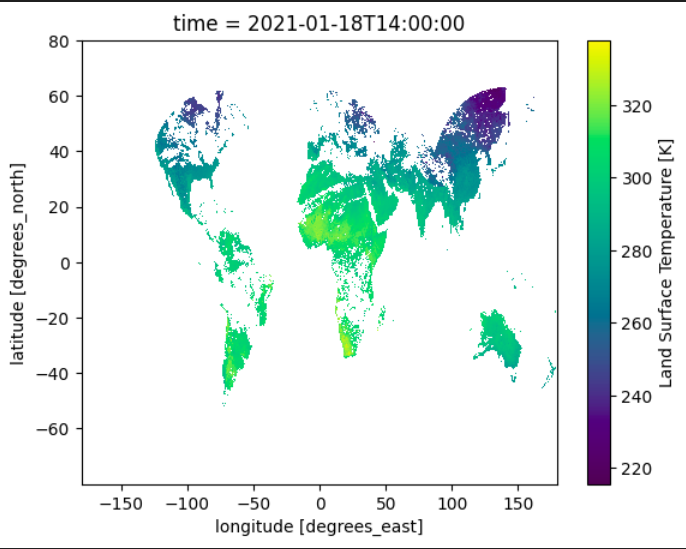

Quick start
===========

Once the plugin is installed, it can be used directly into a Jupyter notebook.

.. code-block:: python

    import climetlab as cml
    from dask.distributed import Client

    # Instantiate a default Dask distributed client to handle data
    client = Client()

    cmlds = cml.load_dataset(
        "wekeo-clms-cgls-hourly-lst-global-v2",
        start="2021-01-18",
        end="2021-01-19",
    )

    ds = cmlds.to_xarray()
    ds.LST.plot(x="lon", y="lat")

    client.shutdown()

.. note::
    When `to_xarray` gets called, it tries to combine all the downloaded files, assuming that they can be either
    concatenated by the time dimension or merged if they feature the same time span and non-overlapping variables.
    Therefore, depending on how the data are sliced through files, the default algorith cannot work or make sense.
    In those cases, it is up to the users to determine the best strategy relatively to their needs.